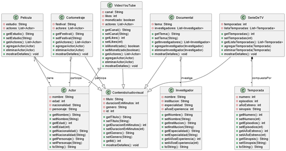

# Proyecto POO: Sistema de Contenidos Audiovisuales

## Descripción General
Este proyecto es un sistema orientado a objetos en Java que modela diferentes tipos de contenidos audiovisuales, como películas, series de TV, documentales, cortometrajes y videos de YouTube. El sistema permite gestionar la información relevante de cada tipo de contenido, así como las relaciones entre actores, temporadas, investigadores y festivales.

## Estructura del Proyecto

- **ContenidoAudiovisual (abstracta):** Clase base para todos los contenidos. Contiene atributos comunes como título, duración, género e ID, y define el método abstracto `mostrarDetalles()` que debe ser implementado por todas las subclases.

### Subclases de ContenidoAudiovisual
- **Pelicula:** Representa una película. Incluye el estudio de producción y una lista de actores asociados.
- **SerieDeTV:** Representa una serie de televisión. Contiene una lista de temporadas (composición), cada una con su propia información.
- **Documental:** Representa un documental. Incluye el tema y una lista de investigadores que participan en el contenido.
- **Cortometraje:** Representa un cortometraje. Incluye el festival principal donde se presentó, una lista de actores y una lista de festivales adicionales.
- **VideoYouTube:** Representa un video de YouTube. Incluye el canal, cantidad de likes, estado de monetización y una lista de actores participantes.

### Clases de Apoyo
- **Actor:** Modela a una persona que interpreta un personaje en un contenido audiovisual. Incluye nombre, edad, nacionalidad y personaje.
- **Temporada:** Modela una temporada de una serie de TV, con número, episodios, año de estreno y sinopsis.
- **Investigador:** Modela a un experto que participa en un documental, con nombre, institución, especialidad y años de experiencia.

## Relaciones entre Clases
- **Herencia:** Todas las clases de contenido audiovisual heredan de `ContenidoAudiovisual`.
- **Agregación/Composición:**
  - `Pelicula` y `VideoYouTube` tienen una lista de `Actor` (agregación).
  - `SerieDeTV` tiene una lista de `Temporada` (composición).
  - `Documental` tiene una lista de `Investigador` (agregación).
  - `Cortometraje` tiene una lista de `Actor` y una lista de festivales (agregación).

## Ejecución y Uso
- El archivo `PruebaAudioVisual.java` contiene un ejemplo de uso donde se crean instancias de todas las clases, se agregan relaciones y se muestran los detalles de cada contenido.
- El sistema puede ser extendido fácilmente agregando nuevos tipos de contenido o relaciones.

## Archivos Principales
- `ContenidoAudiovisual.java`
- `Pelicula.java`
- `SerieDeTV.java`
- `Documental.java`
- `Cortometraje.java`
- `VideoYouTube.java`
- `Actor.java`
- `Temporada.java`
- `Investigador.java`
- `PruebaAudioVisual.java`

## Diagrama de Clases
El archivo `src/img/diagrama_de_clases.png` contiene el diagrama de clases del proyecto en formato PNG.

A continuación se muestra una vista previa del diagrama de clases generado para este sistema:



---

## Instrucciones para clonar el repositorio

1. Abre una terminal o consola de comandos.
2. Ejecuta el siguiente comando:

```bash
git clone https://github.com/cmarca26/poo_u2.git
```

3. Ingresa a la carpeta del proyecto:

```bash
cd poo_u2
```

4. Abre el proyecto en tu IDE favorito y compílalo como un proyecto Java estándar.

---

## Autor
Carlos Marca.
Estudiante de segundo ciclo de la carrera de Ingeniería de Software
**Universidad Politécnica Salesiana**
